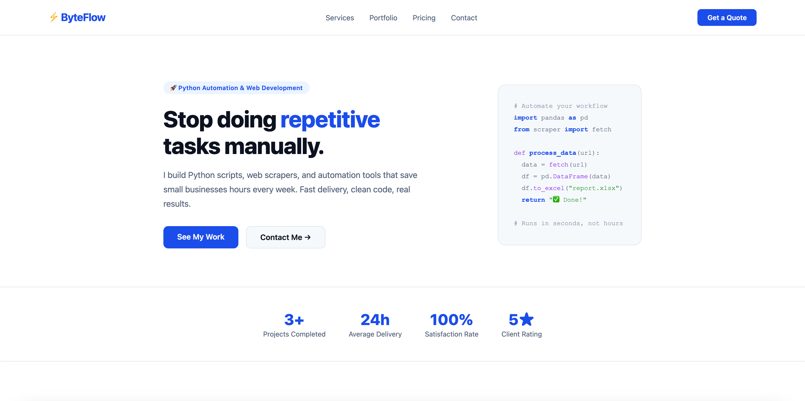
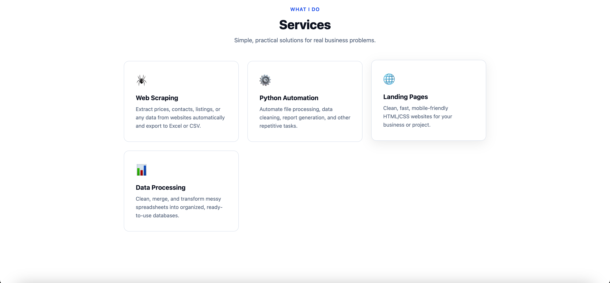

# 🌐 ByteFlow Landing Page

Pure frontend (no functionality, just a showcase) -  clean, responsive landing page for a freelance automation & web development business.
## Preview



## Features
- Fully responsive (mobile, tablet, desktop)
- Sticky navigation bar
- Hero section with code snippet visual
- Stats bar
- Services cards with hover effects
- Call-to-action section
- Pure HTML + CSS — no frameworks, no dependencies

## Usage
```bash
# 1.
git clone https://github.com/adamcodes11/byteflow-landing-page.git
cd byteflow-landing-page
# or simply download zip file

# 2. Run
open index.html       # Mac
xdg-open index.html   # Linux
start index.html      # Windows
# or just double-click `index.html` in your file explorer.
```


